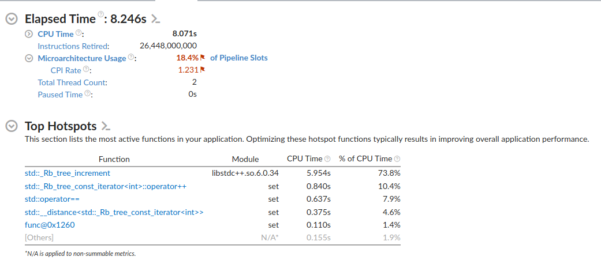
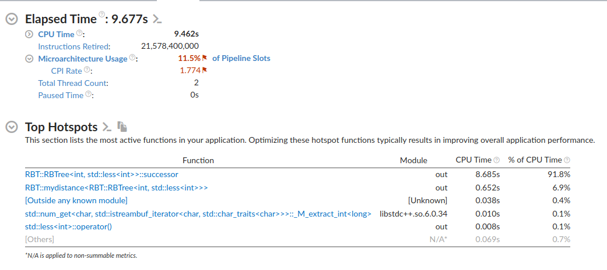

# Red-Black Tree

## Правила

1) Каждый узел либо красный, либо чёрный.
2) Корень всегда чёрный.
3) Все листья чёрные.
4) Оба потомка красного узла — чёрные.
5) Любой путь от узла к его потомкам содержит одинаковое число чёрных узлов (чёрная высота).

## Сборка и запуск

### Сборка

```bash
git clone https://github.com/Matvey787/RBTree.git
cmake -S . -B build && cmake --build build
```

### Запуск

Запустить мою реализацию:

```bash
build/out k 1 k 2 k 3 k 4 k 5 q 1 3
```

Запуск дерева поиска из STL:  

```bash
build/set k 1 k 2 k 3 k 4 k 5 q 1 3
```

### Вывод

Программа выводит список, в котором каждый элемент это количество элементов в дереве в каждом запрошенном диапозоне. (запрос это например `q 1 3`)

## Сравнение производительности

Берем в качестве теста этот [файл](tests/performanceTest.dat)

### Стандартный set

**СУММИРУЕМ ПЕРВЫЕ ЧЕТЫРЕ СТРОЧКИ = 7.794 секунды**


### Красно-черное дерево

**СУММИРУЕМ ПЕРВЫЕ ДВЕ СТРОЧКИ = 9.337 секунды**

